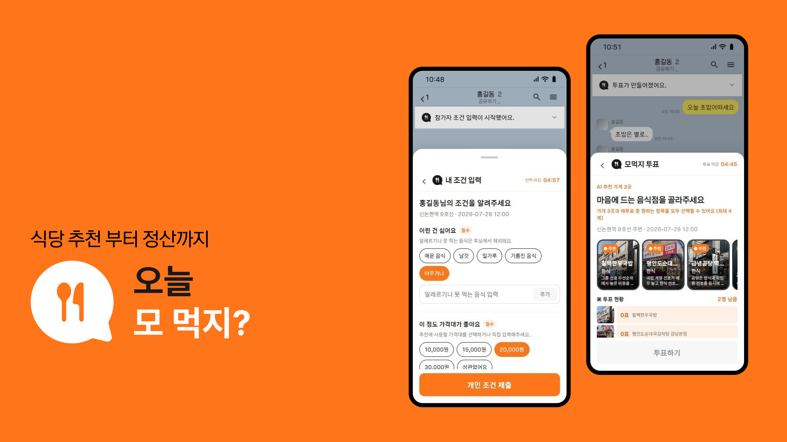
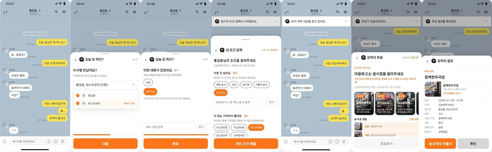
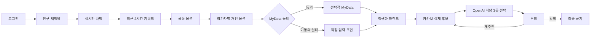
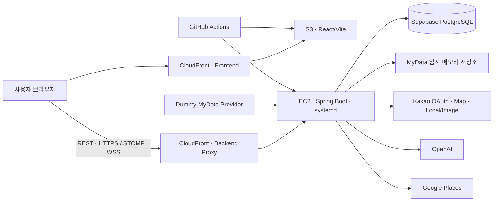

# 모먹지 (Momeogji)

> 채팅방의 대화와 참여자별 조건을 실제 음식점 3곳으로 구체화하고, 투표와 최종 공지까지 한 흐름으로 연결하는 그룹 의사결정 서비스



## 바로가기

| 구분          | 링크                                                                                                                                    |
| ------------- | --------------------------------------------------------------------------------------------------------------------------------------- |
| 배포 서비스   | [모먹지 실행하기](https://d3syj51ll6yq4a.cloudfront.net/)                                                                               |
| API 문서      | [Swagger UI](https://d1llv9lskrx5vw.cloudfront.net/swagger-ui.html)                                                                     |
| 프로젝트 문서 | [Notion 프로젝트 홈](https://app.notion.com/p/momeokji/1c72e073c0e3837997f5017a13efd3c7)                                                |
| 기술 문서     | [기술 보고서](https://app.notion.com/p/d0c2e073c0e3821a9aaf019efb07b479)                                                                |
| 화면 설계     | [Figma](https://www.figma.com/design/9RbAxoRILDrcQTgY634Dkd/%EC%A0%9C%EB%AA%A9-%EC%97%86%EC%9D%8C?node-id=16-2947&t=gSVer82mZtyRsdFu-1) |

## 프로젝트 소개

단체 채팅에서 식당을 정할 때는 참여자를 확인하고, 각자의 예산·제외 음식·분위기를 모으고, 지도에서 후보를 찾은 뒤 다시 투표와 공지를 진행해야 합니다. `모먹지`는 이 과정을 채팅방 안의 하나의 흐름으로 압축합니다.

최근 대화에서 추천 조건을 추출하고 참가자가 직접 입력한 조건과 선택적으로 동의한 MyData를 결합합니다.
AI는 카카오에서 검색한 실제 후보 안에서만 서로 다른 식당 3곳을 선택하며, 그룹 투표 결과를 규칙에 따라 확정하거나 다음 추천 회차로 연결합니다.

주요 사용 사례는 **직장 점심과 소규모 모임**입니다.
프로젝트 배경과 기획 의도는 [프로젝트 소개](https://app.notion.com/p/2f12e073c0e3839d8914012ba0eb8154)에서 확인할 수 있습니다.

## 핵심 기능

| 기능             | 상태   | 핵심 동작                                                                            | 상세 문서                                                                                     |
| ---------------- | ------ | ------------------------------------------------------------------------------------ | --------------------------------------------------------------------------------------------- |
| UI/UX            | 구현   | 모바일형 바텀시트, 단계형 입력, 드래그·키보드·접근성 상태 대응                       | [모먹지 UI/UX 구현](https://app.notion.com/p/3aa2e073c0e381c2b4abcb6a741e9e36)                |
| 친구·실시간 채팅 | 구현   | UID 친구 요청, 방 생성·8자리 코드 입장·초대·나가기, REST 이력과 STOMP 메시지         | [채팅방 구성·실시간 채팅 프로세스](https://app.notion.com/p/3aa2e073c0e381db8707c2c7abcdc33a) |
| 채팅 키워드      | 구현   | 최근 2시간 대화와 DB 음식 사전을 분석해 유형별 최대 7개 노출, 전체 최대 3개 선택     | [채팅 키워드 추출 프로세스](https://app.notion.com/p/3a72e073c0e3804886a1f4f6ddc2d3e1)        |
| 공통·개인 옵션   | 구현   | 모임 공통 설정과 참가자별 조건을 분리하고 전원 제출 시 추천 자동 시작                | [공통·개인 옵션 처리 프로세스](https://app.notion.com/p/3aa2e073c0e38036a843c81de43e7954)     |
| MyData           | 시연용 | 참가자별 선택 동의, Dummy 카드 내역 처리, 실패가 조건 저장과 추천을 막지 않도록 격리 | [마이데이터 프로세스](https://app.notion.com/p/3a72e073c0e38032a3a6d3342e67d317)              |
| AI 추천          | 구현   | 직접 입력·MyData를 정규화해 결합하고 카카오 실제 후보 중 OpenAI가 식당 3곳 선택      | [데이터 기반 AI 추천 프로세스](https://app.notion.com/p/3a72e073c0e380baadc9ec0874ce1701)     |
| 투표·최종 확정   | 구현   | 1~4개 복수 선택, 재추천, 동률·무투표 판정, 최종 공지 저장과 실시간 전송              | [투표·재추천·최종 확정 프로세스](https://app.notion.com/p/3aa2e073c0e381cab625f0e7159e711f)   |

## 서비스 흐름





저장 상태는 `PREFERENCE_COLLECTING → VOTING → FINALIZED/EXPIRED`로 전이합니다. `RECOMMENDING`은 enum에는 있지만 현재 DB 상태로 저장하지 않으며, 추천 진행은 `STARTED/COMPLETED/FAILED` 실시간 이벤트로 구분합니다.

> 자세한 책임 경계는 [기술 보고서](https://app.notion.com/p/d0c2e073c0e3821a9aaf019efb07b479)에 정리되어 있습니다.

## 시스템 구조



| 경계            | 책임                                                                        |
| --------------- | --------------------------------------------------------------------------- |
| REST            | 로그인, 친구·채팅방 명령, 메시지 이력, 모임 생성, 조건 제출, 투표·상태 조회 |
| STOMP WebSocket | 새 메시지, 모임 초대, 제출 현황, 추천 진행, 득표 현황, 최종 공지            |
| PostgreSQL      | 회원·친구·채팅·모임·추천 회차·투표·최종 결과 등 복원 가능한 상태            |
| 메모리 저장소   | 동의한 참가자의 정제된 MyData 임시 결과                                     |

> 배포 구성과 운영 방식은 [배포 인프라 구조](https://app.notion.com/p/3a72e073c0e380d0b586fb5b81dd194b)를 참고하세요.

## 기술 스택

| 영역              | 기술                                                                                               |
| ----------------- | -------------------------------------------------------------------------------------------------- |
| Frontend          | React 19.2.7, React Router 7.18.1, Axios 1.18.1, STOMP.js 7.3.0, Vite 8.1.4                        |
| Backend           | Java 21, Spring Boot 3.5.16, Spring Security, Spring Data JPA, MyBatis, Validation, WebSocket, AOP |
| Backend Libraries | JJWT 0.12.6, Caffeine, springdoc OpenAPI 2.8.17                                                    |
| Data              | PostgreSQL, Supabase Session Pooler                                                                |
| External API      | Kakao OAuth·Map·Local/Image, OpenAI API, Google Places API                                         |
| Infra             | AWS EC2, S3, CloudFront, systemd, GitHub Actions                                                   |
| Verification      | JUnit 5, Gradle Wrapper, ESLint, Vite Build                                                        |

## 현재 구현 범위와 한계

| 구분        | 현재 범위                                                                               |
| ----------- | --------------------------------------------------------------------------------------- |
| 음식점 정보 | 카카오 Local API가 반환한 실제 후보를 사용하며 AI가 이름·주소·좌표를 임의 생성하지 않음 |
| MyData      | 실제 금융기관 연동이 아닌 Dummy 카드 승인내역을 사용하며 시연 사용자는 최대 3명         |
| 이동 범위   | 개인 이동 가능 시간을 프론트엔드에서 10분으로 고정해 전달                               |
| 채팅        | 읽지 않은 메시지 수는 현재 `0` 고정이며 일부 메시지 조회 멤버십 검증 보완 필요          |
| 상태 복구   | 개인 조건 수집과 추천 진행은 복원하지만 투표·최종 결과 재접속 UI는 일부 미연결          |
| 친구        | 요청·수락·거절·목록은 구현되어 있고 친구 삭제는 미구현                                  |

> 최신 기능별 구현 상태와 제한값은 [간단 기능 정의서](https://app.notion.com/p/fa02e073c0e38326ab27813a9fdeae13)를 기준으로 관리합니다.

## 프로젝트 구조

```text
thein_teamProj/
├── backend/             # Spring Boot API, 도메인 로직, 외부 API 연동, 테스트
├── frontend/            # React 화면, REST·STOMP 클라이언트, UI 상태 관리
├── docs/                # DB 설계와 SQL 참고 자료
└── .github/workflows/   # 백엔드·프론트엔드 자동 배포
```

## 팀 소개

| 이름   | 이경준                                                                                                                                                                                          | 박진원                                                                                  | 이서준                                                                                                    |
| ------ | ----------------------------------------------------------------------------------------------------------------------------------------------------------------------------------------------- | --------------------------------------------------------------------------------------- | --------------------------------------------------------------------------------------------------------- |
| E-mail | kanell0304@gmail.com                                                                                                                                                                            | wkadlf999@naver.com                                                                     | 1007ckddjs12@gmail.com                                                                                    |
| Github | [kanell0304](https://github.com/kanell0304)                                                                                                                                                     | [Paengnyeon](https://github.com/Paengnyeon)                                             | [lsj1206](https://github.com/lsj1206)                                                                     |
| 역할   | 팀장, Backend                                                                                                                                                                                   | 팀원, Frontend                                                                          | 팀원, Backend                                                                                             |
| 상세   | • PL<br>• WebSocket 채팅방<br>• OpenAI API<br>• 음식점 추첨<br>• 친구 추가/방 코드 참여<br>• Kakao API<br>&nbsp;&nbsp;(Kakao Map, Login)<br>• Infra(배포), CI/CD<br>&nbsp;&nbsp;(AWS, Supabase) | • 디자인 및 UI/UX<br>• 카카오맵 API 연동<br>• React-SpringBoot 데이터 연결<br>• DB 설계 | • 기획<br>• Notion 작성<br>• 마이데이터<br>• Kakao API<br>&nbsp;&nbsp;(Kakao Local)<br>• 채팅 키워드 추출 |
